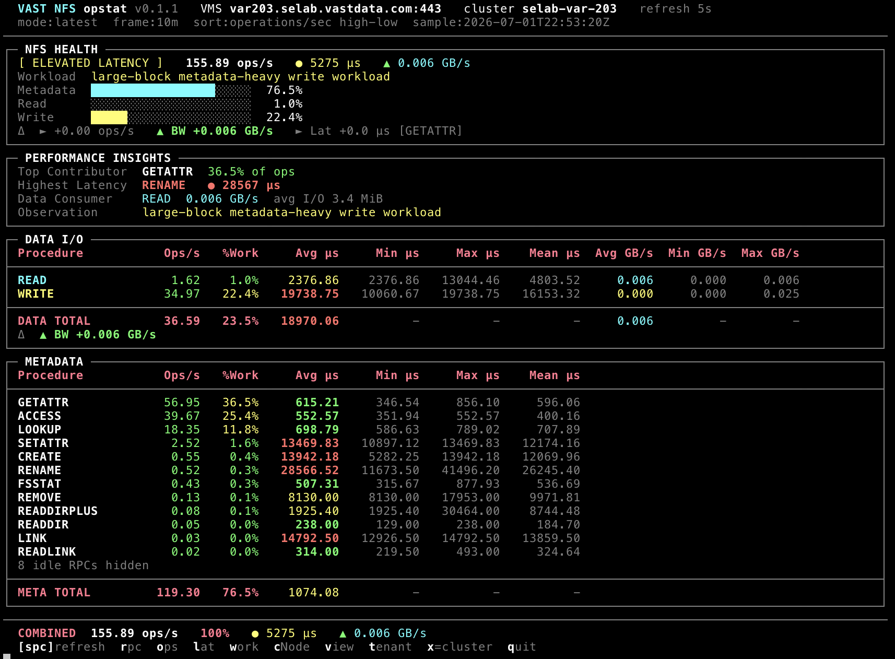

# opstat - NFS v3

Live NFS v3 RPC performance monitor for VAST VMS clusters.

Displays NFS RPC operation statistics with health summaries, workload
classification, latency metrics, throughput, I/O sizing, refresh-delta tracking,
and interactive drill-down - in a terminal display that refreshes on an interval.



**Implementation:** [nfs_v3.py](nfs_v3.py) · **Setup:** [SETUP.md](SETUP.md)

---

## Quick Start

```bash
./opstat --nfs --version=3.0 --vms <VMS_HOST> --user admin
./opstat --nfs --version=3.0 --vms <VMS_HOST> --discover-metrics
```

If `--password` is omitted, you will be prompted securely. The `VAST_PASSWORD`
environment variable is also accepted.

### Remote cluster via SSH tunnel

```bash
ssh -L 8443:var203.selab.vastdata.com:443 user@jump-host
./opstat --nfs --version=3.0 --vms localhost --vms-port 8443 --user admin
```

---

## CLI Options

```
opstat --nfs --version=3.0 [options]
```

| Option | Default | Description |
|--------|---------|-------------|
| `--nfs` | - | Select NFS protocol (required) |
| `--version=3.0` | - | NFS version (required with `--nfs`) |
| `--vms HOST` | - | VMS hostname or IP |
| `--vms-port PORT` | `443` | VMS HTTPS port (`--port` legacy alias) |
| `--user USER` | `admin` | VMS username |
| `--password PASS` | - | VMS password |
| `--sample-average WIN` | - | Rolling average window (`10m`, `1h`, `4h`) |
| `--refresh N` | `5` | Refresh interval in seconds |
| `--csv FILENAME` | - | Append captured samples to CSV |
| `--no-color` | - | Disable ANSI color output |
| `--discover-metrics` | - | Print available metrics and objects, then exit |
| `--log-api-calls` | - | Log VMS REST API traffic to `/tmp/opstat-api-*.log` |
| `-V` / `--tool-version` | - | Print opstat version |

Shared connection flags are documented in [README.md](README.md).

---

## Display Layout

Each refresh cycle renders four panels:

1. **NFS HEALTH** - status badge, total ops/s, combined latency, throughput, workload mix bars, refresh deltas
2. **PERFORMANCE INSIGHTS** - top contributor, highest latency, data consumer, top delta mover
3. **DATA I/O** - READ and WRITE rows with throughput and I/O size
4. **METADATA** - all other RPC procedures, sorted interactively

A combined footer shows cluster totals and keyboard shortcut hints.

---

## Telemetry Processing

NFS v3 uses **two cluster monitors** per session (RPC + bandwidth). The module
normalizes VMS monitor payloads into true real-time telemetry:

### Cluster dashboard (primary path)

- RPC ops/s come from VMS `NfsMetrics,nfs_{op}_latency__rate` series (instantaneous rates).
- Bandwidth comes from `ProtoMetrics,proto_name=NFSCommon,rd_bw/wr_bw`.
- Average I/O size is derived as `throughput ÷ IOPS` when both are present.

### Counter delta state engine

Where VMS exposes **cumulative counters** instead of rates - notably **tenant-scoped**
`TenantMetrics,*__sum` during tenant drill-down - opstat applies an elapsed-time delta
engine:

```
rate = (counter_now − counter_prev) / Δt
```

- `Δt` is wall time between the two newest API timestamps in the monitor series
  (`_delta_rate_from_samples`).
- Latency averages use paired `__sum` / `__num_samples` delta ratios where required.
- Counter resets (negative delta) clamp to zero growth.

### Refresh-cycle deltas

Between successive dashboard refreshes, the **delta row** in the health panel compares
the current sample snapshot to the previous poll (`compute_deltas`) for ops, bandwidth,
and latency movement - independent of the cumulative counter engine.

---

## Keyboard Controls

| Key | Action |
|-----|--------|
| `Space` | Force immediate refresh |
| `r` | Sort by RPC name (A-Z) |
| `o` | Sort by operations/sec (high→low) |
| `l` | Sort by average latency (high→low) |
| `w` | Sort by % workload (high→low) |
| **`c`** | **Toggle per-cNode performance breakdown** |
| **`v`** | **Toggle per-NFS View path breakdown** |
| **`t`** | **Toggle per-Tenant breakdown** |
| **`x`** | **Return to primary cluster dashboard view** |
| `q` | Quit |

View and tenant drill-down rank up to 32 candidates with a **single batch rank monitor**,
select the top 8 by ops/s, then maintain one **batch display monitor** for ongoing
refreshes (one API query per cycle instead of per-object probes).

Press `c`, `v`, or `t` again while in drill mode to switch scope. Use `x` to exit all
drill modes and restore cluster monitors.

---

## Drill-Down Mode

| Mode | Key | VMS endpoint | `object_type` | Metrics |
|------|-----|--------------|---------------|---------|
| cNode | `c` | `/cnodes/` | `cnode` | `NfsMetrics` + `NFSCommon` bandwidth |
| View | `v` | `/views/` | `view` | `ViewMetrics,*__rate/__avg` (no aggregation) |
| Tenant | `t` | `/tenants/` | `tenant` | `TenantMetrics,*__sum/__num_samples` (delta-derived rates) |

Flow:

1. Fetch object list from VMS.
2. For view/tenant: batch-rank candidates by activity, keep top 8.
3. Create scope-appropriate monitors (batch for view/tenant, per-object for cnode).
4. Refresh on the normal interval; rows sorted by total ops/s.
5. Press `x` to tear down drill monitors and return to cluster view.

> View monitors require **seconds resolution without aggregation**. Tenant scope cannot
> use cluster `NfsMetrics` - tenant counters require the delta engine described above.

---

## Workload Classification

| Classification | Heuristic |
|----------------|-----------|
| Idle / no load | < 0.5 ops/s total |
| directory traversal | READDIR/READDIRPLUS > 25% of ops |
| namespace churn | CREATE+MKDIR+REMOVE+RMDIR > 30% |
| metadata-heavy | metadata ops ≥ 80% |
| read-heavy | READ > 3× WRITE, I/O ≥ 80% |
| write-heavy | WRITE > 3× READ, I/O ≥ 80% |
| balanced read/write | both I/O types active, I/O ≥ 80% |
| mixed workload | mixed I/O and metadata |

I/O size qualifiers (`small-file` < 8 KiB, `large-block` ≥ 64 KiB) prepend the label
when I/O operations dominate.

---

## Color Coding & Latency Thresholds

| Color | Meaning |
|-------|---------|
| **Bold cyan** | READ ops, headers |
| **Bold yellow** | WRITE ops, drill mode indicator |
| **Bold green** | Healthy latency (<1 ms), positive deltas |
| **Yellow** | Moderate latency (1-10 ms), >10% workload |
| **Bold red** | High latency (>10 ms), >50% workload |

| Status | Threshold |
|--------|-----------|
| HEALTHY | < 1,000 µs |
| MODERATE LATENCY | 1,000-5,000 µs |
| ELEVATED LATENCY | 5,000-10,000 µs |
| DEGRADED | 10,000-50,000 µs |
| CRITICAL | > 50,000 µs |

---

## CSV Export

With `--csv nfs.csv`, each refresh appends one row per RPC procedure including
timestamps, cluster identity, metric values, and run statistics.

---

## Metric Discovery

```bash
./opstat --nfs --version=3.0 --vms <VMS_HOST> --discover-metrics
```

Reports cluster identity, object counts (`/cnodes/`, `/views/`, `/tenants/`),
available NFS metric FQNs, and drill-down availability per object type.

---

## Monitored RPC Procedures

All 22 standard NFS v3 RPC operations: NULL, GETATTR, SETATTR, LOOKUP, ACCESS,
READLINK, READ, WRITE, CREATE, MKDIR, SYMLINK, MKNOD, REMOVE, RMDIR, RENAME,
LINK, READDIR, READDIRPLUS, FSSTAT, FSINFO, PATHCONF, COMMIT.

---

## API Interaction

| Monitor | Metrics | Purpose |
|---------|---------|---------|
| RPC | `NfsMetrics,nfs_{op}_latency__rate/__avg` | Per-procedure ops and latency |
| Bandwidth | `ProtoMetrics,proto_name=NFSCommon,rd_bw/wr_bw` | Read/write throughput |

Monitors use `object_type=cluster` at startup and are deleted on exit (including
SIGINT/SIGTERM). Drill-down creates temporary scope monitors cleaned up on exit or
when pressing `x`.

---

## Architecture

```
opstat  (--nfs --version=3.0)
    │
    ▼
nfs_v3.run()
    ├── get_current_cluster()
    ├── create_monitor("rpc") + create_monitor("bw")
    │
    └── loop every REFRESH_SECONDS
            ├── fetch_monitor_query()
            ├── fetch_drill_query()   (if c/v/t drill active)
            └── render_screen()
```

---

## Examples

```bash
# Live monitor
./opstat --nfs --version=3.0 --vms var203.selab.vastdata.com --user admin

# Rolling one-hour average
./opstat --nfs --version=3.0 --vms var203.selab.vastdata.com --sample-average 1h

# CSV export + API debug log
./opstat --nfs --version=3.0 --vms var203.selab.vastdata.com \
  --csv nfs_stats.csv --log-api-calls
```
