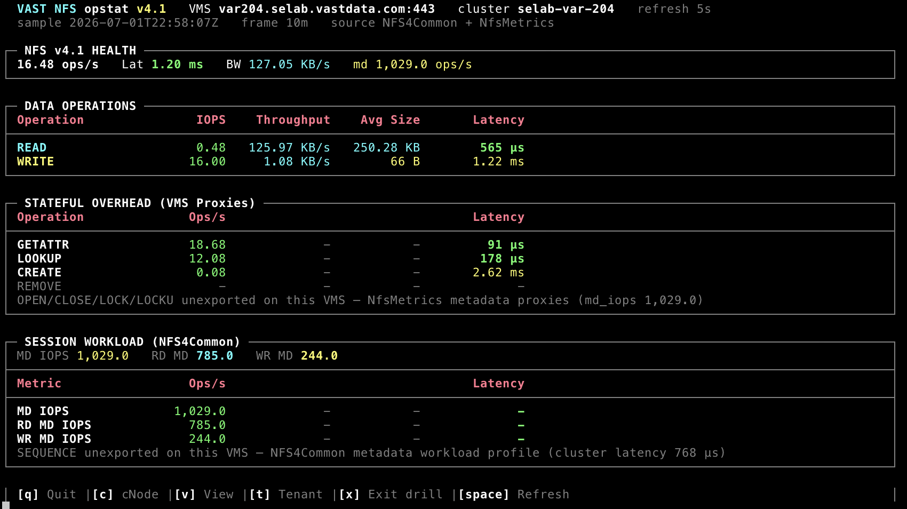

# opstat - NFS v4.1

Live NFS v4.1 performance telemetry from VAST VMS. Unlike NFS v3 (stateless RPC
procedures), v4.1 is session-oriented with compound operations and in-protocol
locking. This module maps **instantaneous monitor rates** directly to the TUI on
each refresh - **no counter-delta engine**.



**Implementation:** [nfs_v41.py](nfs_v41.py) · **Setup:** [SETUP.md](SETUP.md)

---

## Quick Start

```bash
cd opstat

# Live dashboard
./opstat --nfs --version=4.1 --vms <VMS_HOST> --user admin

# Metric discovery
./opstat --nfs --version=4.1 --vms <VMS_HOST> --discover-metrics
```

Shared CLI flags (`--vms-port`, `--refresh`, `--sample-average`, `--csv`, `--no-color`,
`--log-api-calls`, `-V`) are documented in [README.md](README.md).

---

## Telemetry Paradigm - Instantaneous Rates

The NFS v4.1 module **bypasses delta computations**. The underlying VMS
`ProtoMetrics,proto_name=NFS4Common` engine delivers metrics as native instantaneous
rates and pre-averaged gauges:

| Field | Semantics |
|-------|-----------|
| `rd_iops` / `wr_iops` | Data-path ops/sec (mapped directly each poll) |
| `rd_bw` / `wr_bw` | Raw bytes/sec (display converts to KB/MB/GB/s) |
| `read_latency__avg` / `write_latency__avg` | Mean latency (µs) for the sample bucket |
| `md_iops`, `rd_md_iops`, `wr_md_iops` | Metadata workload rates |

Average I/O size is derived each refresh as `throughput ÷ IOPS`.

There is no `PREV_COUNTER_STATE` warmup cycle like NFS v3 tenant drill or NVMe block
cluster mode.

---

## Dashboard Panels

### 1. Data Operations

Primary source: `ProtoMetrics,proto_name=NFS4Common`.

| Row | Metrics |
|-----|---------|
| READ | `rd_iops`, `rd_bw`, `read_latency__avg` |
| WRITE | `wr_iops`, `wr_bw`, `write_latency__avg` |

**Hybrid fallback:** When NFS4Common data counters read zero but the cluster shows
NFS traffic, opstat supplements from:

- `NfsMetrics,nfs_{read,write}_latency__rate/__avg` for IOPS and latency
- `ProtoMetrics,proto_name=NFSCommon,rd_bw/wr_bw` for throughput

The title bar shows `source NfsMetrics supplement` when fallback is active.

### 2. State / Locking / Session (adaptive)

opstat now **probes the metric catalog at startup** (`probe_available_state_ops`)
and, when the cluster exports them, renders **native** stateful/session/delegation
counters directly: **OPEN, CLOSE, LOCK, UNLOCK (LOCKU)**, `OPEN_CONFIRM`,
`OPEN_DOWNGRD`, `LOCK_TEST`, `REL_LCKOWNER`, delegations (`DELEG_RETURN`,
`DELEG_PURGE`), and v4.1 session ops (`SEQUENCE`, `EXCHANGE_ID`, `CREATE_SESS`,
`DESTROY_SESS`, `BIND_CONN`, `RECLAIM_CMPL`).

Only ops the cluster actually exposes are monitored - the catalog result trims the
candidate list, and the choice is verified by monitor creation. If **none** are
exported (older builds), the panel automatically falls back to the proxy view below.
Run `--discover-metrics` to see the live exported/not-exported status per op.

Monitor: `STATE` (`build_state_monitor_props()`), created only when at least one op
is available.

#### Fallback: Namespace & Metadata Ops (real NfsMetrics)

When native OPEN/CLOSE/LOCK counters are **not exported** by the VMS time-series
engine (all builds through 5.5.x - confirmed via live `--discover-metrics`), the pane
renders the **full set of real, exported NFS namespace/metadata operations** with
measured rate + average latency (not synthetic proxies):

`ACCESS, GETATTR, LOOKUP, SETATTR, READDIR, READDIRPLUS, CREATE, REMOVE, RENAME,
MKDIR, RMDIR, LINK, SYMLINK, READLINK, COMMIT`

Each maps to `NfsMetrics,nfs_<op>_latency__rate / __avg`. Only ops with active
traffic in the current sample are shown. The footer also surfaces **commit-wait**
(`NfsMetrics,commit_wait_latency__avg`) - server-side write-durability wait time.

Monitor: `SUPPLEMENT` (`build_supplement_monitor_props()`).

### 3. Session Workload (NFS4Common)

Because native **SEQUENCE** compound-operation counters are unexported, the **Session
Workload** panel maps cumulative metadata aggregates from NFS4Common to macro workload
profiles:

| Metric | Source | Meaning |
|--------|--------|---------|
| MD IOPS | `ProtoMetrics,proto_name=NFS4Common,md_iops` | Total metadata ops/sec |
| RD MD IOPS | `ProtoMetrics,proto_name=NFS4Common,rd_md_iops` | Read-side metadata ops/sec |
| WR MD IOPS | `ProtoMetrics,proto_name=NFS4Common,wr_md_iops` | Write-side metadata ops/sec |

An aggregate summary line (`MD IOPS / RD MD / WR MD`) appears above the table.

Monitor: `META` (`build_meta_monitor_props()`).

---

## Proxy Architecture

```
opstat --nfs --version=4.1
        └── nfs_v41.run()
                ├── DATA monitor        NFS4Common rd/wr IOPS, bw, latency
                ├── SUPPLEMENT monitor  NfsMetrics proxy rows (GETATTR…REMOVE)
                ├── STATE monitor       native OPEN/CLOSE/LOCK/UNLOCK/session (if exported)
                ├── BW monitor          NFSCommon throughput fallback
                ├── META monitor        md_iops session workload profile
                └── drill monitors      per cnode / view / tenant (optional)
```

Each monitor is a separate `POST /api/monitors/` because VMS restricts mixed metric
categories. Query results are merged client-side before rendering.

Drill-down endpoints are path-relative to `BASE_URL` (`/cnodes/`, `/views/`,
`/tenants/`) - never `/api/api/...`.

---

## Interactive Keys

| Key | Action |
|-----|--------|
| `o` | Sort tables by operations/sec (high→low) |
| `l` | Sort tables by average latency (high→low) |
| `n` | Reset to default (defined) order |
| **`c`** | **cNode drill-down** - `GET /cnodes/`, `object_type=cnode` |
| **`v`** | **View drill-down** - `GET /views/`, `object_type=view` |
| **`t`** | **Tenant drill-down** - `GET /tenants/`, `object_type=tenant` |
| **`x`** | Exit drill-down, return to cluster dashboard |
| `Space` | Force immediate refresh |
| `q` | Quit |

Sorting applies to the DATA, NAMESPACE/METADATA, and STATE panels; inactive rows
(0 ops) always sink to the bottom. The active sort is shown in the header line.

Press `c`, `v`, or `t` to enter the corresponding scope. Press `x` to exit.

> Block storage reuses `v` for **VIP** drill-down - that binding applies only to
> `--block --nvme-over-tcp`. See [NVMe_TCP_README.md](NVMe_TCP_README.md).

---

## CLI Reference

| Flag | Description |
|------|-------------|
| `--nfs --version=4.1` | Enable NFS v4.1 mode (required pair) |
| `--vms HOST` | VMS hostname or IP |
| `--discover-metrics` | Print metric catalog + drill availability, then exit |
| `--refresh N` | Poll interval (default 5s) |
| `--sample-average WIN` | Rolling monitor window (`10m`, `1h`, …) |
| `--no-color` | Plain ASCII output |
| `--csv FILE` | CSV capture |
| `--log-api-calls` | REST debug log under `/tmp` |

---

## Examples

```bash
# Live monitor
./opstat --nfs --version=4.1 --vms var203.selab.vastdata.com --user admin

# Rolling average + CSV
./opstat --nfs --version=4.1 --vms var203.selab.vastdata.com \
  --sample-average 1h --csv nfs41_stats.csv

# SSH tunnel
ssh -L 8443:var203.selab.vastdata.com:443 user@jump-host
./opstat --nfs --version=4.1 --vms localhost --vms-port 8443 --user admin

# Discover proxy + NFS4Common availability
./opstat --nfs --version=4.1 --vms var203.selab.vastdata.com --discover-metrics
```

---

## Related Documentation

- [README.md](README.md) - protocol matrix and global flags
- [NFSv3_README.md](NFSv3_README.md) - NFS v3 delta engine and view/tenant drill-down
- [SETUP.md](SETUP.md) - first-time install on macOS and Windows
