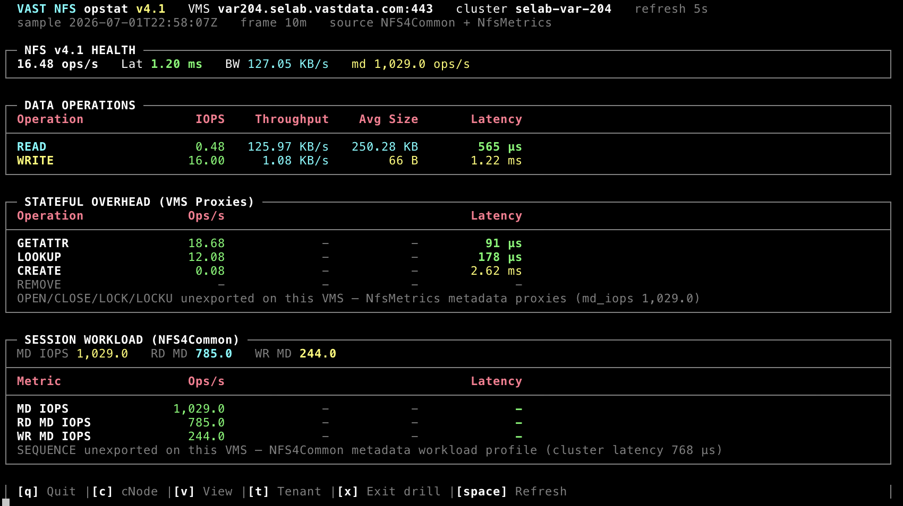

# opstat - NFS v4.1

Live NFS v4.1 performance telemetry from VAST VMS. Unlike NFS v3 (stateless RPC
procedures), v4.1 is session-oriented with compound operations and in-protocol
locking. This module maps **instantaneous monitor rates** directly to the TUI on
each refresh - **no counter-delta engine**.



**Implementation:** [nfs_v41.py](nfs_v41.py) · **Setup:** [SETUP.md](SETUP.md)

---

## Quick Start

```bash
cd opstat

# Live dashboard
./opstat --nfs --version=4.1 --vms <VMS_HOST> --user admin

# Metric discovery
./opstat --nfs --version=4.1 --vms <VMS_HOST> --discover-metrics
```

Shared CLI flags (`--vms-port`, `--refresh`, `--sample-average`, `--csv`, `--no-color`,
`--log-api-calls`, `-V`) are documented in [README.md](README.md).

---

## Telemetry Paradigm - Instantaneous Rates

The NFS v4.1 module **bypasses delta computations**. The underlying VMS
`ProtoMetrics,proto_name=NFS4Common` engine delivers metrics as native instantaneous
rates and pre-averaged gauges:

| Field | Semantics |
|-------|-----------|
| `rd_iops` / `wr_iops` | Data-path ops/sec (mapped directly each poll) |
| `rd_bw` / `wr_bw` | Raw bytes/sec (display converts to KB/MB/GB/s) |
| `read_latency__avg` / `write_latency__avg` | Mean latency (µs) for the sample bucket |
| `md_iops`, `rd_md_iops`, `wr_md_iops` | Metadata workload rates |

Average I/O size is derived each refresh as `throughput ÷ IOPS`.

There is no `PREV_COUNTER_STATE` warmup cycle like NFS v3 tenant drill or NVMe block
cluster mode.

---

## Dashboard Panels

### 1. Data Operations

Primary source: `ProtoMetrics,proto_name=NFS4Common`.

| Row | Metrics |
|-----|---------|
| READ | `rd_iops`, `rd_bw`, `read_latency__avg` |
| WRITE | `wr_iops`, `wr_bw`, `write_latency__avg` |

**Hybrid fallback:** When NFS4Common data counters read zero but the cluster shows
NFS traffic, opstat supplements from:

- `NfsMetrics,nfs_{read,write}_latency__rate/__avg` for IOPS and latency
- `ProtoMetrics,proto_name=NFSCommon,rd_bw/wr_bw` for throughput

The title bar shows `source NfsMetrics supplement` when fallback is active.

### 2. State / Locking / Session (adaptive)

opstat now **probes the metric catalog at startup** (`probe_available_state_ops`)
and, when the cluster exports them, renders **native** stateful/session/delegation
counters directly: **OPEN, CLOSE, LOCK, UNLOCK (LOCKU)**, `OPEN_CONFIRM`,
`OPEN_DOWNGRD`, `LOCK_TEST`, `REL_LCKOWNER`, delegations (`DELEG_RETURN`,
`DELEG_PURGE`), and v4.1 session ops (`SEQUENCE`, `EXCHANGE_ID`, `CREATE_SESS`,
`DESTROY_SESS`, `BIND_CONN`, `RECLAIM_CMPL`).

Only ops the cluster actually exposes are monitored - the catalog result trims the
candidate list, and the choice is verified by monitor creation. If **none** are
exported (older builds), the panel automatically falls back to the proxy view below.
Run `--discover-metrics` to see the live exported/not-exported status per op.

Monitor: `STATE` (`build_state_monitor_props()`), created only when at least one op
is available.

#### Fallback: Namespace & Metadata Ops (real NfsMetrics)

When native OPEN/CLOSE/LOCK counters are **not exported** by the VMS time-series
engine (all builds through 5.5.x - confirmed via live `--discover-metrics`), the pane
renders the **full set of real, exported NFS namespace/metadata operations** with
measured rate + average latency (not synthetic proxies):

`ACCESS, GETATTR, LOOKUP, SETATTR, READDIR, READDIRPLUS, CREATE, REMOVE, RENAME,
MKDIR, RMDIR, LINK, SYMLINK, READLINK, COMMIT`

Each maps to `NfsMetrics,nfs_<op>_latency__rate / __avg`. Only ops with active
traffic in the current sample are shown. The footer also surfaces **commit-wait**
(`NfsMetrics,commit_wait_latency__avg`) - server-side write-durability wait time.

Monitor: `SUPPLEMENT` (`build_supplement_monitor_props()`).

### 3. Session Workload (NFS4Common)

Because native **SEQUENCE** compound-operation counters are unexported, the **Session
Workload** panel maps cumulative metadata aggregates from NFS4Common to macro workload
profiles:

| Metric | Source | Meaning |
|--------|--------|---------|
| MD IOPS | `ProtoMetrics,proto_name=NFS4Common,md_iops` | Total metadata ops/sec |
| RD MD IOPS | `ProtoMetrics,proto_name=NFS4Common,rd_md_iops` | Read-side metadata ops/sec |
| WR MD IOPS | `ProtoMetrics,proto_name=NFS4Common,wr_md_iops` | Write-side metadata ops/sec |

An aggregate summary line (`MD IOPS / RD MD / WR MD`) appears above the table.

Monitor: `META` (`build_meta_monitor_props()`).

---

## Proxy Architecture

```
opstat --nfs --version=4.1
        └── nfs_v41.run()
                ├── HEADLINE monitor    merged DATA + SUPPLEMENT + BW + META (+ STATE)
                │       (split fallback: one monitor per group on clusters
                │        that reject the merged prop list)
                │         ├── DATA        NFS4Common rd/wr IOPS, bw, latency
                │         ├── SUPPLEMENT  NfsMetrics proxy rows (GETATTR…REMOVE)
                │         ├── STATE       native OPEN/CLOSE/LOCK/UNLOCK/session (if exported)
                │         ├── BW          NFSCommon throughput fallback
                │         └── META        md_iops session workload profile
                └── drill monitors      per cnode / view / tenant (optional)
```

The five prop groups are created as **one merged monitor** (a single
`POST /api/monitors/` and a single query per refresh) — the same mixed-family
prop list the drill-down monitors have always used. The merged monitor is
validated with a probe query at startup; if the cluster rejects it or omits a
prop family, the engine falls back to one monitor per group and merges query
results client-side, exactly as before.

Drill-down endpoints are path-relative to `BASE_URL` (`/cnodes/`, `/views/`,
`/tenants/`) - never `/api/api/...`.

---

## Drill-Down Mode

| Mode | Key | `object_type` | Metric family |
|------|-----|---------------|---------------|
| cNode | `c` | `cnode` | `NFS4Common` + `NfsMetrics` + `NFSCommon` (same as cluster) |
| View | `v` | `view` | `ViewMetrics,*__rate/__avg` (no aggregation) |
| Tenant | `t` | `tenant` | `TenantMetrics,*__sum/__num_samples` (delta-derived rates) |

`NfsMetrics`/`ProtoMetrics` are cluster- and cNode-scoped families; a monitor
requesting them with `object_type=view` or `=tenant` is rejected by current VMS
builds. View and tenant scopes therefore use `ViewMetrics`/`TenantMetrics` — the same
object-scope families the NFSv3 engine uses, since these are properties of the object,
not of the NFS version.

View and tenant candidates are **ranked by activity** before selection (via
[`vast_drill`](vast_drill.py): one server-side `/monitors/topn/` request, else the
fewest batched rank monitors the cluster accepts, cached for 5 minutes). Taking the
head of `/views/` instead would show eight arbitrary — usually idle — views on a
cluster with hundreds.

All three scopes use **one batch monitor** covering every drill object, so a refresh
issues one query rather than one per row. cNode batching is probe-validated at entry
and falls back to per-object monitors if the response cannot be split by `object_id`.
Drill monitors are re-queried at most every 15 s because object-scoped families
publish roughly once a minute; `Space` forces an immediate re-query.

`ViewMetrics`/`TenantMetrics` account only for operations VMS can attribute to a view
or tenant, so drill rows legitimately sum to less than the cluster total. The panel
states the shortfall rather than scaling numbers to match, and says so plainly when
the two scopes are not directly comparable (tenant rates are differentiated from
cumulative counters; cluster rates are instantaneous).

---

## Interactive Keys

| Key | Action |
|-----|--------|
| `o` | Sort tables by operations/sec (high→low) |
| `l` | Sort tables by average latency (high→low) |
| `n` | Reset to default (defined) order |
| **`c`** | **cNode drill-down** - `GET /cnodes/`, `object_type=cnode` |
| **`v`** | **View drill-down** - `GET /views/`, `object_type=view` |
| **`t`** | **Tenant drill-down** - `GET /tenants/`, `object_type=tenant` |
| **`x`** | Exit drill-down, return to cluster dashboard |
| `Space` | Force immediate refresh |
| `q` | Quit |

Sorting applies to the DATA, NAMESPACE/METADATA, and STATE panels; inactive rows
(0 ops) always sink to the bottom. The active sort is shown in the header line.

Press `c`, `v`, or `t` to enter the corresponding scope. Press `x` to exit.

> Block storage reuses `v` for **VIP** drill-down - that binding applies only to
> `--block --nvme-over-tcp`. See [NVMe_TCP_README.md](NVMe_TCP_README.md).

---

## CLI Reference

| Flag | Description |
|------|-------------|
| `--nfs --version=4.1` | Enable NFS v4.1 mode (required pair) |
| `--vms HOST` | VMS hostname or IP |
| `--discover-metrics` | Print metric catalog + drill availability, then exit |
| `--refresh N` | Poll interval (default 5s) |
| `--sample-average WIN` | Rolling monitor window (`10m`, `1h`, …) |
| `--no-color` | Plain ASCII output |
| `--csv FILE` | CSV capture |
| `--log-api-calls` | REST debug log under `/tmp` |

---

## Examples

```bash
# Live monitor
./opstat --nfs --version=4.1 --vms var203.selab.vastdata.com --user admin

# Rolling average + CSV
./opstat --nfs --version=4.1 --vms var203.selab.vastdata.com \
  --sample-average 1h --csv nfs41_stats.csv

# SSH tunnel
ssh -L 8443:var203.selab.vastdata.com:443 user@jump-host
./opstat --nfs --version=4.1 --vms localhost --vms-port 8443 --user admin

# Discover proxy + NFS4Common availability
./opstat --nfs --version=4.1 --vms var203.selab.vastdata.com --discover-metrics
```

---

## Related Documentation

- [README.md](README.md) - protocol matrix and global flags
- [NFSv3_README.md](NFSv3_README.md) - NFS v3 delta engine and view/tenant drill-down
- [SETUP.md](SETUP.md) - first-time install on macOS and Windows
