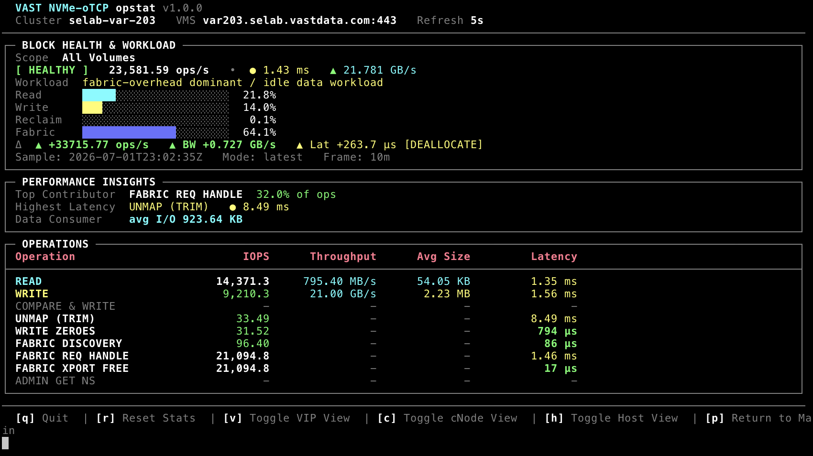

# opstat - NVMe-oTCP Block Monitoring

Enterprise-grade, live NVMe-over-TCP block performance monitor for VAST VMS clusters.
Queries VMS performance counters and renders a full-screen terminal dashboard with
cluster-wide or multi-volume scoping, host initiator drill-down, path health views,
and CSV export.



**Implementation:** [nvme_tcp.py](nvme_tcp.py) · **Setup:** [SETUP.md](SETUP.md)

---

## Quick Start

```bash
# Cluster-wide block telemetry (all volumes)
./opstat --block --nvme-over-tcp --vms var203.selab.vastdata.com --user admin

# Scope to one or more volumes
./opstat --block --nvme-over-tcp --vms var203.selab.vastdata.com \
  --volumes kmacs-block-vol1,kmacs-block-vol2 --user admin

# Metric discovery (no live dashboard)
./opstat --block --nvme-over-tcp --vms var203.selab.vastdata.com --discover-metrics
```

If `--password` is omitted, you are prompted securely. The `VAST_PASSWORD` environment
variable is also accepted.

---

## CLI Syntax

```
opstat --block --nvme-over-tcp --vms <HOST> [options]
```

### Required flags

| Flag | Description |
|------|-------------|
| `--block` | Select block storage protocol |
| `--nvme-over-tcp` | NVMe-oTCP transport (required with `--block`) |
| `--vms HOST` | VMS hostname or IP |

### Block-specific scoping

| Flag | Description |
|------|-------------|
| `--volume NAME` | Limit stats to a single volume (alias for `--volumes`) |
| `--volumes vol1,vol2` | Comma-separated volume names to scope monitors |

When volume scoping is active, monitors use `object_type=volume` and `VolumeMetrics`
for **read/write** only. Reclaim, fabric, and admin operations continue to use
cluster-scoped `BlockMetrics` supplement monitors so those rows stay populated.

### Shared connection & output options

See [README.md](README.md) for `--vms-port`, `--sample-average`, `--refresh`, `--csv`,
`--no-color`, `--discover-metrics`, `--log-api-calls`, and `-V` / `--tool-version`.

---

## TUI Layout

Each refresh cycle redraws a fixed-width terminal dashboard (UTF-8 box drawing when
supported). The main view has three core sections:

### 1. BLOCK HEALTH & WORKLOAD

| Element | Description |
|---------|-------------|
| **Scope** | `All Volumes` or resolved volume name(s) when `--volume` / `--volumes` is set |
| **Status badge** | `HEALTHY`, `IDLE`, `HIGH LATENCY`, etc. |
| **Aggregate metrics** | Total data-path IOPS, weighted latency, throughput |
| **Workload classification** | Derived label (see [Advanced Workload Tagging](#advanced-workload-tagging)) |
| **Proportional bars** | Read (cyan), Write (yellow), Reclaim (magenta), Fabric (blue) |
| **Delta row** | Change since previous sample |

### 2. PERFORMANCE INSIGHTS

Top contributor, highest latency operation, and IOPS-weighted data consumer size.

### 3. OPERATIONS Table

Per-operation IOPS, throughput, average I/O size, and latency. Zero-activity rows
display `-`.

---

## Telemetry Architecture - Dual-Monitor Loop

VMS **cannot mix** `BlockMetrics`, `VolumeMetrics`, and `ProtoMetrics` in a single
monitor. opstat runs a **dual (or triple) monitor loop** each refresh:

```
create_cluster_monitors()
    ├── BlockMetrics / VolumeMetrics ops monitors  (one group per compatible op)
    ├── Cluster supplement monitors                (when --volumes is set)
    └── ProtoMetrics BlockCommon monitor           (rd_bw, wr_bw, size gauges)
            │
            ▼
    loop every REFRESH_SECONDS
            ├── GET all ops monitor queries
            ├── GET ProtoMetrics query
            ├── merge rows client-side
            ├── apply_op_rates()      ← counter delta engine
            └── render_screen()
```

| Monitor set | Object scope | Metrics | Role |
|---------------|--------------|---------|------|
| Primary ops | `cluster` or `volume` | `BlockMetrics,*_req` or `VolumeMetrics,*__rate` | Data-path IOPS + latency |
| Cluster supplement | `cluster` | Reclaim, fabric, admin BlockMetrics | Always cluster-wide when volume-scoped |
| Proto | Same as primary scope | `ProtoMetrics,proto_name=BlockCommon,*` | Throughput + size gauges |

Results are merged in `build_rows_from_results()` before rendering.

### Counter delta tracking

For cumulative `BlockMetrics,*_req` counters:

```
IOPS = (counter_now − counter_prev) / Δt
```

- `Δt` = elapsed wall time between polls (`time.monotonic()`).
- State keyed per scope (`cluster`, `volume`, `vip`, `cnode`, `blockhost`).
- First poll shows **warming up** until a second sample establishes a baseline.
- Negative deltas (counter reset) treat the current value as the new baseline.

Fabric/admin ops using `*_latency__rate` are consumed directly as ops/sec (no delta).

### Block size calculation

Average I/O size is derived from throughput and delta IOPS:

```
avg_io_bytes = (throughput_MB/s × 1_000_000) ÷ IOPS
```

Where throughput comes from `ProtoMetrics,proto_name=BlockCommon,rd_bw/wr_bw` (bytes/sec
converted to MB/s) and IOPS from the delta engine above.

At volume scope, when `VolumeMetrics,*_size__avg` is available, size and throughput
can also be computed as:

```
throughput_MB/s = IOPS × avg_io_size_bytes / 1_000_000
```

Human-readable display scales bytes to **B**, **KB**, or **MB** (`format_block_size`).

---

## Advanced Workload Tagging

`classify_block_workload()` evaluates rules in priority order:

| Condition | Label |
|-----------|-------|
| Total ops < 0.5/s | `Idle / no block load` |
| Fabric ops > **50%** of total | `fabric-overhead dominant / idle data workload` |
| Reclaim ops > **30%** of total | `space-reclamation heavy (TRIM/UNMAP) workload` |
| Weighted avg I/O size < **32 KiB** | `small-block random` profile |
| Weighted avg I/O size > **256 KiB** | `large-block sequential` profile |
| Otherwise | `mixed-block` profile |

When data-path ops > 0, direction suffix is applied:

| Condition | Suffix |
|-----------|--------|
| Read ops > **70%** of data-path ops | `read-heavy` |
| Write ops > **70%** of data-path ops | `write-heavy` |
| Otherwise | `mixed read/write` |

Example outputs: `small-block random read-heavy workload`,
`large-block sequential write-heavy workload`.

Proportional mix bars use the same category keys: read, write, reclaim, fabric.

Health badge thresholds: **IDLE** below 0.5 data IOPS; **HIGH LATENCY** when read
latency > 2,000 µs or write latency > 5,000 µs; otherwise **HEALTHY**.

---

## Interactive Views & Keybinds

> **Important:** On block storage, **`v` means VIP**, not NFS View. NFS view drill-down
> exists only in NFS v3/v4.1 modules.

| Key | Action |
|-----|--------|
| **`h`** | **Toggle ranked Host Initiator list** - block hosts from `/blockhosts/` (`object_type=blockhost`). Shows host name, NQN subtitle, IOPS, throughput, weighted latency. |
| **`v`** | **Toggle Virtual IP (VIP) performance list** - per-VIP stats from `/vips/` (`object_type=vip`). Surfaces front-end multipath imbalance. |
| **`c`** | **Toggle per-cNode transport path list** - per-cNode stats from `/cnodes/` (`object_type=cnode`). |
| `p` | Return to main operations table (exit drill-down) |
| `r` | Reset session stats and delta baselines |
| `q` | Quit - tears down all VMS monitors |

Drill-down views query **cluster-scoped BlockMetrics + ProtoMetrics** on the target
object, even when the main dashboard is volume-scoped. Up to 8 objects are monitored
per drill mode. Press the same drill key again to toggle back to the main view.

---

## Monitored Operations

| UI Label | Cluster BlockMetrics | When `--volumes` is set |
|----------|---------------------|-------------------------|
| READ | `read_req` + avg | `VolumeMetrics,read_latency__rate/avg` |
| WRITE | `write_req` + avg | `VolumeMetrics,write_latency__rate/avg` |
| COMPARE & WRITE | cluster BlockMetrics | cluster supplement |
| UNMAP (TRIM) | cluster BlockMetrics | cluster supplement |
| WRITE ZEROES | cluster BlockMetrics | cluster supplement |
| FABRIC / ADMIN ops | cluster BlockMetrics | cluster supplement |

---

## CSV Export & Metric Discovery

```bash
./opstat --block --nvme-over-tcp --vms <HOST> --csv nvme.csv
./opstat --block --nvme-over-tcp --vms <HOST> --discover-metrics
```

Discovery reports cluster identity, object counts, BlockMetrics/VolumeMetrics catalog,
ProtoMetrics bandwidth fields, drill availability, and known telemetry gaps.

---

## Architecture

```
opstat  (--block --nvme-over-tcp)
    │
    ▼
nvme_tcp.run()
    ├── configure_volume_scope()       # optional --volume / --volumes
    ├── create_cluster_monitors()      # BlockMetrics + ProtoMetrics loop
    └── loop every REFRESH_SECONDS
            ├── fetch_monitor_query()
            ├── apply_op_rates()
            ├── fetch_drill_query()    # vip / cnode / host
            └── render_screen()
```

---

## API Assumptions

- VMS at `https://{host}[:{port}]/api/` with HTTP Basic Auth or token auth.
- `BlockMetrics`, `VolumeMetrics`, and `ProtoMetrics` cannot share one monitor.
- Unrelated BlockMetrics operations cannot share one monitor (one monitor per op group).
- Path drill-down: `object_type=vip`, `cnode`, or `blockhost`.
- Volume names in `--volumes` resolved via `GET /api/volumes/`.

---

## Examples

```bash
./opstat --block --nvme-over-tcp --vms var203.selab.vastdata.com \
  --sample-average 10m --refresh 5

./opstat --block --nvme-over-tcp --vms var203.selab.vastdata.com \
  --volume kmacs-block-vol1 --csv nvme_block_stats.csv --log-api-calls

ssh -L 8443:var203.selab.vastdata.com:443 user@jump-host
./opstat --block --nvme-over-tcp --vms localhost --vms-port 8443 --user admin
```
