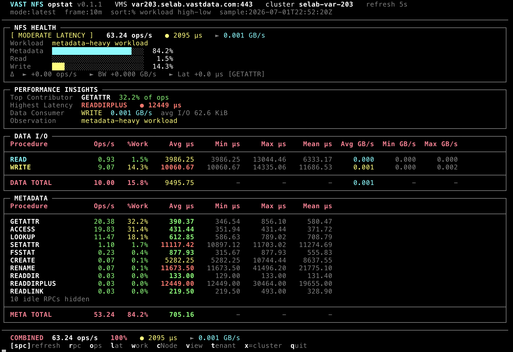

# opstat

Live multi-protocol performance statistics for **VAST Data** clusters.

`opstat` talks to VMS over HTTPS, creates short-lived monitors, polls protocol counters on a refresh loop, and renders a color terminal dashboard. Use it when you need instant visibility into NFS, SMB, S3, or NVMe-oTCP behavior without opening Grafana or building custom REST scripts.

**Version:** 0.1.2 · **Runtime:** Python 3.8+ (stdlib only) · **Author:** KMac (`kmac@vastdata.com`)



---

## Overview

### What it does

| Capability | Detail |
|------------|--------|
| Protocols | NFS v3, NFS v4.1, SMB/SMB2, S3 object storage, NVMe over TCP (block) |
| Live TUI | Health badge, workload mix, ops/s, latency, throughput, I/O size |
| Drill-down | Keyboard shortcuts for cNode, view, tenant, VIP, host (protocol-dependent) |
| Capture | CSV append and optional OpenMetrics/OpenTelemetry JSON Lines export |
| Wizard | Interactive setup when run with no args on a TTY |

### How it works under the hood

```
┌─────────────┐    HTTPS/REST     ┌──────────┐
│   opstat    │ ───────────────► │   VMS    │
│  (CLI/TUI)  │ ◄─────────────── │ monitors │
└─────────────┘   poll metrics   └──────────┘
       │
       ├─ nfs_v3.py / nfs_v41.py / smb.py / s3.py / nvme_tcp.py
       ├─ vast_common.py   (auth, monitor lifecycle, signals)
       ├─ tui_layout.py    (column layout helpers)
       └─ openmetrics.py   (optional .jsonl export)
```

1. Authenticate to VMS (`--user` / password or `VAST_PASSWORD` / `VAST_TOKEN`).
2. Create ad-hoc monitors scoped to cluster, volume, view, tenant, or client as needed.
3. Poll on `--refresh` (default 5s), normalize rates and latencies, and redraw the TUI.
4. On exit (Ctrl-C), delete ad-hoc monitors and restore the terminal.

### Target use cases

- Lab and support: quick "is the cluster hot right now?" checks
- Protocol triage: separate data path vs metadata vs session/state overhead
- Scoped debug: focus on one volume (`--volumes`), SMB client (`--clients`), or S3 bucket/tenant (`--buckets` / `--tenants`)
- Telemetry capture: `--csv` for spreadsheets, `--export-openmetrics` for pipelines
- Remote access: SSH/Teleport tunnels with `--vms localhost --vms-port <local>`

---

## Installation

### Option A: Run as a script (developers / Python available)

```bash
git clone https://github.com/kmacvast/opstat.git
cd opstat

# Optional but recommended
python3 -m venv .venv
source .venv/bin/activate          # Windows: .venv\Scripts\activate

# No pip packages required at runtime (stdlib only)
chmod +x opstat
./opstat --help
```

New to Python on this machine? Step-by-step OS setup: **[SETUP.md](SETUP.md)**.

### Option B: Standalone binaries (no Python install)

Pre-built single-file executables are published on
[GitHub Releases](https://github.com/kmacvast/opstat/releases).

| Platform | Artifact name (typical) |
|----------|-------------------------|
| Linux x86_64 | `opstat-linux-x86_64` |
| macOS Apple Silicon | `opstat-macos-arm64` |
| Windows x86_64 | `opstat-windows-x86_64.exe` |

```bash
# Linux / macOS (after downloading from GitHub Releases)
chmod +x ./opstat-linux-x86_64
./opstat-linux-x86_64 --nfs --version=3.0 --vms <HOST> --user admin

# Windows (PowerShell)
.\opstat-windows-x86_64.exe --smb --vms <HOST> --user admin
```

Build your own locally: see [Building stand-alone binaries](#building-stand-alone-binaries) below.

---

## Usage Guide

### Interactive wizard

```bash
./opstat              # no args on a TTY -> wizard
./opstat --menu       # force wizard
./opstat --no-menu ...  # never launch wizard
```

The wizard never prints secrets. It exports `VAST_PASSWORD` / `VAST_TOKEN` into the
process environment and can seed host/user from `~/.vastconf`.

### Protocol selection (exactly one)

| Protocol | Flags | Status | Deep dive |
|----------|-------|--------|-----------|
| NFS v3 | `--nfs --version=3.0` | Implemented | [NFSv3_README.md](NFSv3_README.md) |
| NFS v4.1 | `--nfs --version=4.1` | Implemented | [NFSv41_README.md](NFSv41_README.md) |
| NVMe-oTCP | `--block --nvme-over-tcp` | Implemented | [NVMe_TCP_README.md](NVMe_TCP_README.md) |
| SMB | `--smb` | Implemented | [SMB_README.md](SMB_README.md) |
| S3 | `--s3` | Implemented | [S3_README.md](S3_README.md) |
| NFS v4.2 | `--nfs --version=4.2` | Planned | |

Rules:

- `--version` is **required** with `--nfs` (aliases: `3`→`3.0`, `4`→`4.1`).
- `--block` **requires** `--nvme-over-tcp`.
- `--client` / `--clients` only with `--smb`.
- `--bucket` / `--buckets` and `--tenant` / `--tenants` only with `--s3`.
- `--volume` / `--volumes` only meaningful with NVMe-oTCP.

### CLI reference

Run `./opstat --help` for the authoritative list. Summary:

#### Connection

| Option | Default | Description |
|--------|---------|-------------|
| `--vms HOST` | (required) | VMS hostname or IP |
| `--vms-port PORT` | `443` | VMS HTTPS port |
| `--user USER` | `admin` | VMS username |
| `--password PASS` | prompt / env | Prefer `VAST_PASSWORD` or interactive prompt |

#### Runtime

| Option | Default | Description |
|--------|---------|-------------|
| `--refresh SEC` | `5` | Dashboard redraw interval |
| `--sample-average WIN` | off | Rolling window (`10m`, `1h`, `4h`, ...) |
| `--csv FILE` | off | Append samples to CSV |
| `--no-color` | off | Plain terminal output |
| `--discover-metrics` | off | List metrics/objects, exit |
| `-V` / `--tool-version` | | Print `opstat <version>` |

#### Scoping

| Option | Protocol | Description |
|--------|----------|-------------|
| `--volume NAME` / `--volumes A,B` | NVMe-oTCP | Scope READ/WRITE to named volumes |
| `--client IP` / `--clients A,B` | SMB | Scope insights / session context |
| `--bucket NAME` / `--buckets A,B` | S3 | Scope bucket/view drill candidates |
| `--tenant NAME` / `--tenants A,B` | S3 | Scope tenant drill candidates |

#### Export and diagnostics

| Option | Description |
|--------|-------------|
| `--log-api-calls` | Write VMS REST traffic to `/tmp/opstat-api-*.log` (secrets redacted) |
| `--export-openmetrics` | Stream gauges to JSON Lines each refresh |
| `--openmetrics-file FILE` | Custom `.jsonl` path (else auto-named under `/tmp`) |

#### Interactive

| Option | Description |
|--------|-------------|
| `--menu` / `-i` | Launch wizard |
| `--no-menu` | Suppress wizard |

---

## Output Deep-Dive

Every protocol shares the same dashboard rhythm: a **header**, one or more **panels**,
and a **footer** with cluster totals and key bindings.

### Header

```
opstat 0.1.2  |  NFS v3  |  cluster: vast-cluster-01  |  refresh: 5s
sample:2026-07-07T17:15:33Z   vast-os-release-5.4.3-sp4
```

| Field | Meaning |
|-------|---------|
| Protocol label | Active engine (NFS v3 / NFS v4.1 / SMB / S3 / NVMe-oTCP) |
| Target | Cluster name, or scoped volume / client / drill object |
| `sample:` | UTC timestamp of the last successful poll |
| `vast-os-release-...` | Cluster OS version (best-effort; omitted if unavailable) |

### Metric columns (shared vocabulary)

| Metric | Unit | Meaning |
|--------|------|---------|
| **ops/s** (or IOPS) | operations per second | Instantaneous rate from VMS `__rate` / IOPS fields, or counter-delta / elapsed time when required |
| **latency** | microseconds (shown as µs or ms) | Average service time for that op or class; colored by severity |
| **throughput** | MB/s or GB/s | Bandwidth derived from bytes/s counters |
| **I/O size** | bytes / KiB | Average transfer size when VMS exports it |
| **Δ (delta)** | same as parent | Change since the previous refresh (▼/▲ arrows) |
| **mix bars** | percent | Share of traffic across read / write / metadata (or protocol-specific classes) |

### Panel map by protocol

**NFS v3** ([details](NFSv3_README.md))

1. **NFS HEALTH** - status badge, total ops/s, combined latency, throughput, mix bars, deltas
2. **PERFORMANCE INSIGHTS** - top contributor, highest latency, data consumer, top delta mover
3. **DATA I/O** - READ / WRITE with throughput and size
4. **METADATA** - remaining RPC procedures (GETATTR, LOOKUP, ...), sortable

**NFS v4.1** ([details](NFSv41_README.md))

1. **Data Operations** - READ / WRITE style path
2. **Stateful Overhead** - open / lock / delegation style cost (native + proxy fallbacks)
3. **Session Workload** - COMPOUND / SEQUENCE oriented activity

**NVMe-oTCP** ([details](NVMe_TCP_README.md))

1. Health and data-path READ/WRITE IOPS + latency
2. Reclaim / fabric / admin supplements at cluster scope
3. Optional volume-scoped data path when `--volumes` is set

**SMB** ([details](SMB_README.md))

1. **SMB HEALTH & WORKLOAD** - ops, latency, BW, metadata/read/write mix
2. **PERFORMANCE INSIGHTS** - top opcode, hot client/share, deltas
3. **SMB2 OPCODE WORKFLOW** - only currently active opcodes ([SMB_OPCODES.md](SMB_OPCODES.md))

**S3** ([details](S3_README.md))

1. **S3 HEALTH & WORKLOAD** - ops, latency (**ms**), BW, GET/PUT/DELETE/LIST+HEAD mix
2. **S3 REST OPERATIONS** - one row per live call (GET, PUT, DELETE, HEAD, LIST, …);
   BW auto-scales KB/MB/GB. Drills show GET/s · PUT/s · DEL/s · LIST/s with Top Op
   as a REST name. See [S3_README.md](S3_README.md) for ViewMetrics / VIP unit notes.

### OpenMetrics lines

With `--export-openmetrics`, each refresh appends gauges such as:

| Metric name | Unit | Meaning |
|-------------|------|---------|
| `vast.<proto>.operations` | ops/s | Operation rate |
| `vast.<proto>.latency` | microseconds | Average latency |
| `vast.<proto>.throughput` | bytes/s | Bandwidth |
| `vast.<proto>.io_size` | bytes | Average I/O size |

`<proto>` is `nfs3`, `nfs41`, `smb`, `s3`, or `nvme_tcp`. Attributes tag `cluster`, `vms`,
`operation`, `category`, and drill scope.

---

## Real-World Examples

### Interactive start

```bash
./opstat
```

Expected: wizard prompts for protocol, VMS host, credentials, options; then the live TUI.

### NFS v3 cluster-wide

```bash
./opstat --nfs --version=3.0 --vms vms.example.com --user admin
```

Expected: four-panel NFS v3 dashboard; password prompt if `VAST_PASSWORD` unset; Ctrl-C cleans up monitors.

### NFS v4.1 with rolling average and CSV

```bash
./opstat --nfs --version=4.1 --vms vms.example.com \
  --sample-average 10m --csv /tmp/nfs41.csv --user admin
```

Expected: NFS v4.1 TUI; samples appended to `/tmp/nfs41.csv` each refresh.

### NVMe-oTCP scoped to volumes

```bash
./opstat --block --nvme-over-tcp --vms vms.example.com \
  --volumes vol-app,vol-db --user admin
```

Expected: block dashboard limited to named volumes for data-path stats; invalid names error before monitors are created.

### SMB focused on two clients

```bash
./opstat --smb --vms vms.example.com \
  --clients 10.1.1.5,10.1.1.6 --user admin --no-color
```

Expected: SMB TUI with client-scoped insights; no ANSI color.

### S3 with bucket scope

```bash
./opstat --s3 --vms vms.example.com \
  --buckets app-data,logs --user admin
```

Expected: S3 TUI; bucket drill (`b`) limited to named buckets/views.

### SSH tunnel to a remote lab

```bash
# Terminal 1
ssh -L 8443:vms.lab.example.com:443 jump.example.com

# Terminal 2
./opstat --nfs --version=3.0 --vms localhost --vms-port 8443 --user admin
```

Expected: same dashboard as a direct connection; TLS talks to `localhost:8443`.

### Discover metrics (no dashboard)

```bash
./opstat --smb --vms vms.example.com --discover-metrics --user admin
```

Expected: printed catalog of objects/properties available for SMB, then exit 0.

### OpenMetrics export

```bash
./opstat --nfs --version=3.0 --vms 10.0.0.50 --export-openmetrics
```

Expected startup line similar to:

```
OpenMetrics export enabled: /tmp/opstat-openmetrics-nfs3-10.0.0.50-20260708-143000.jsonl
```

### Version and help

```bash
./opstat -V
./opstat --help
```

```
opstat 0.1.2
```

---

## Building stand-alone binaries

PyInstaller bundles `opstat` and its local modules into one executable. Builds are
**native to the host OS**: compile Linux binaries on Linux, macOS on macOS, Windows on Windows
(or use the GitHub Actions matrix in [`.github/workflows/release.yml`](.github/workflows/release.yml)).

### One-shot helpers

```bash
# Linux / macOS
./scripts/build.sh

# Windows (cmd)
scripts\build.bat
```

Or via Python:

```bash
python3 -m pip install pyinstaller
python3 scripts/build_opstat.py
```

Artifacts land in `releases/` (local) and `dist/` during the build (ignored by git).

### Manual PyInstaller command

```bash
pyinstaller \
  --onefile \
  --name opstat \
  --clean \
  --noconfirm \
  --paths . \
  --hidden-import nfs_v3 \
  --hidden-import nfs_v41 \
  --hidden-import nvme_tcp \
  --hidden-import smb \
  --hidden-import s3 \
  --hidden-import wizard \
  --hidden-import vast_common \
  --hidden-import vast_api_log \
  --hidden-import openmetrics \
  --hidden-import tui_layout \
  opstat
```

See [`scripts/build_opstat.py`](scripts/build_opstat.py) for the canonical hidden-import list and
output naming (`opstat-<os>-<arch>`).

Tag pushes (`v*`) trigger CI builds for Linux, macOS, and Windows and attach binaries to
the GitHub Release automatically.

---

## Protocol feature notes

| Area | NFS v3 | NFS v4.1 | NVMe-oTCP | SMB | S3 |
|------|--------|----------|-----------|-----|-----|
| Cluster scope | yes | yes | yes | yes | yes |
| Volume scope | | | `--volumes` | | |
| Client scope | | | | `--clients` | |
| Bucket / tenant scope | | | | | `--buckets` / `--tenants` |
| Drill-down | cNode / view / tenant | cNode / view / tenant | cNode / VIP / host | view / tenant / cNode | cNode / bucket / tenant / VIP |
| OpenMetrics | yes | yes | yes | yes | yes |

---

## Requirements

- Python 3.8+ **or** a pre-built binary from Releases
- HTTPS reachability to VMS (default port 443)
- No third-party runtime packages ([requirements.txt](requirements.txt))

Optional for development: `pytest`, `pyinstaller`.

---

## Repository layout

```
opstat                 # CLI entrypoint (executable)
nfs_v3.py              # NFS v3 engine
nfs_v41.py             # NFS v4.1 engine
nvme_tcp.py            # NVMe-oTCP engine
smb.py                 # SMB engine
s3.py                  # S3 object storage engine
wizard.py              # Interactive launcher
vast_common.py         # Shared VMS helpers
openmetrics.py         # JSON Lines exporter
S3_README.md           # S3 protocol reference
scripts/               # PyInstaller build helpers
releases/              # Local binary build staging (not committed)
.github/workflows/     # Tag-triggered multi-OS releases
```

---

## Credits

NFS v3 monitoring logic builds on the original work of **Jeff Mohler (J-Mo)**
in `vast-nfstop.py`.

---

## License

See [LICENSE](LICENSE).
