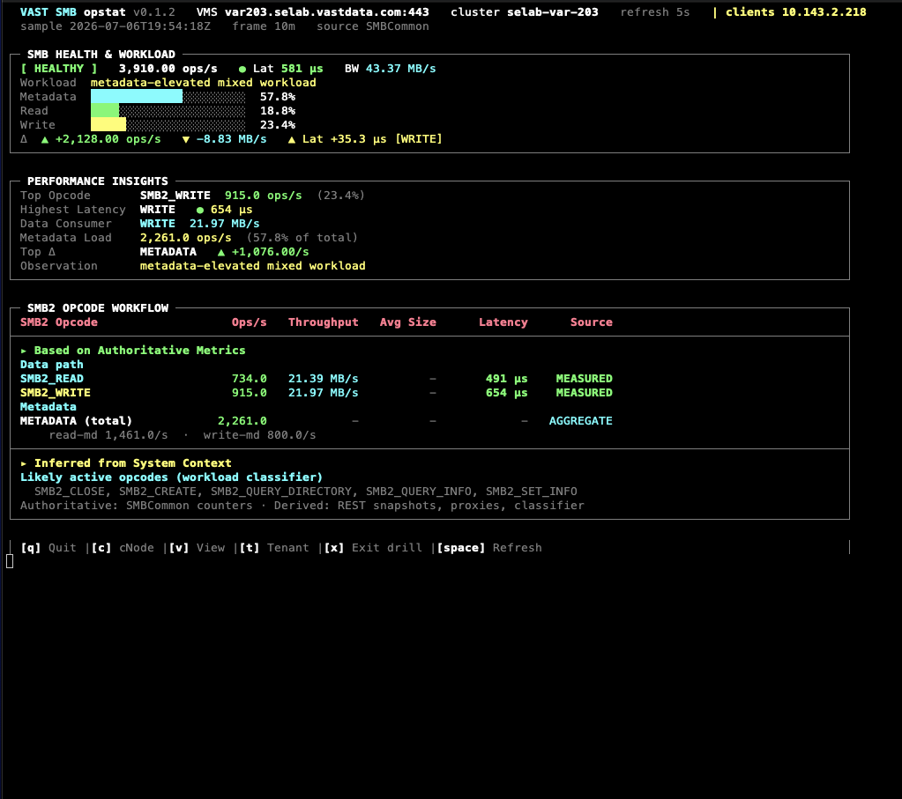

# opstat - SMB

Live SMB performance telemetry from VAST VMS. Maps **ProtoMetrics SMBCommon**
instantaneous rates to a three-panel TUI tuned for metadata-heavy Windows/macOS
workloads. Per-command `SmbMetrics` is not exported on current VMS builds - metadata
appears as a single **METADATA (total)** aggregate row with an optional read-md /
write-md split sub-line.



**Version:** 0.1.2 · **Implementation:** [smb.py](smb.py) · **Setup:** [SETUP.md](SETUP.md) ·
**Opcodes:** [SMB_OPCODES.md](SMB_OPCODES.md) · **Discovery:** [SMB_PHASE0_RESULTS.md](../../docs/dev/smb/SMB_PHASE0_RESULTS.md)

---

## Quick Start

```bash
cd opstat

# Live dashboard
./opstat --smb --vms <VMS_HOST> --user admin

# Metric discovery (read-only)
./opstat --smb --vms <VMS_HOST> --discover-metrics
```

Shared CLI flags (`--vms-port`, `--refresh`, `--sample-average`, `--csv`, `--no-color`,
`--log-api-calls`, `-V`) are documented in [README.md](README.md).

### Generate SMB load (Windows client)

```powershell
.\scripts\Invoke-SmbOpstatLoad.ps1 -NasShare '\\172.200.203.6\opstattest'
```

---

## Telemetry Source - SMBCommon

Primary cluster monitor props (Phase 0 validated on var203):

| Field | Role |
|-------|------|
| `rd_iops` / `wr_iops` | Data-path op rates |
| `rd_bw` / `wr_bw` | Throughput (bytes/s → MB/s in TUI) |
| `md_iops`, `rd_md_iops`, `wr_md_iops` | Metadata workload |
| `read_latency__avg` / `write_latency__avg` | Data-path latency |
| `read_size__avg` / `write_size__avg` | Avg I/O size proxies |
| `write_latency__rate` / `wr_latency` | Write latency fallbacks when avg is zero |
| `notify_counter` | CHANGE_NOTIFY proxy rate |
| `NfsMetrics,nfs3_smb_interop_*` | NFS/SMB interop lease-break counters |

**Not exported:** `SmbMetrics,smb_{cmd}_latency__*` (HTTP 400 `property_error`).
On startup opstat probes `SmbMetrics`; when a future VMS build enables per-command export,
the opcode panel switches to native rates automatically.

### Workload mix bars

Health panel mix uses **component sum** (`rd + wr + md`) as the denominator so
metadata percentage never exceeds 100%. The aggregate `SMBCommon,iops` field is often
data-path only and must not be used alone for mix math.

---

## Dashboard Panels (v0.1.2)

1. **SMB HEALTH & WORKLOAD** - status badge, ops/lat/BW, mix bars (metadata / read / write), delta arrows
2. **PERFORMANCE INSIGHTS** - top opcode, highest latency, data consumer, metadata load, top client/share, top Δ
3. **SMB2 OPCODE WORKFLOW** - only opcodes with live data this refresh (see below)

---

## SMB2 Opcode Workflow Panel

Full opcode reference and calculation details: **[SMB_OPCODES.md](SMB_OPCODES.md)**.

The panel is split into two sections:

| Section | Contents |
|---------|----------|
| **Based on Authoritative Metrics** | `SMB2_READ`, `SMB2_WRITE`, `METADATA (total)` - direct `SMBCommon` counters (or native `SmbMetrics` when exported) |
| **Inferred from System Context** | Notify proxy, lock/handle snapshots, session connection proxies, NFS/SMB interop counters, workload-classifier opcode hints |

The opcode table shows **only active opcodes** for the current refresh. Empty rows
(`SMB2_CREATE`, `SMB2_QUERY_INFO`, etc.) are omitted rather than displayed with dashes.

### Category layout

**Based on Authoritative Metrics**

| Category | When shown |
|----------|------------|
| **Data path** | `SMB2_READ` and/or `SMB2_WRITE` when `rd_iops` / `wr_iops` > 0 |
| **Metadata** | `METADATA (total)` when `md_iops` > 0; sub-line shows `read-md` / `write-md` split |

**Inferred from System Context**

| Category | When shown |
|----------|------------|
| **Notify** | `SMB2_CHANGE_NOTIFY` when `notify_counter` rate > 0 |
| **Locking** | `SMB2_LOCK` when open handles report locks |
| **Session / tree** | Negotiate / session / tree-connect proxies when client connections exist |
| **NFS/SMB interop** | `NfsMetrics,nfs3_smb_interop_*` lease-break counters when elevated |
| **Classifier hints** | Likely metadata opcodes when workload is metadata-heavy (no per-opcode rate) |

### Source labels

| Source | Meaning |
|--------|---------|
| `MEASURED` | Direct from `SMBCommon` (`SMB2_READ`, `SMB2_WRITE`) |
| `AGGREGATE` | Metadata total from `md_iops` (per-opcode split not exported by VMS) |
| `SMBMETRICS` | Native per-opcode export (when VMS exposes `SmbMetrics`) |
| `HANDLES` / `SESSIONS` | Snapshot from open-handle / client-connection APIs |
| `PROXY` | `CHANGE_NOTIFY` via `notify_counter` |
| `INTEROP` | NFS/SMB interop counters in derived section |

Footer: `Authoritative: SMBCommon counters · Derived: REST snapshots, proxies, classifier`

---

## Drill-Down

| Key | Scope | Metrics |
|-----|-------|---------|
| `c` | cNode | `ProtoMetrics,proto_name=SMBCommon,*` |
| `v` | View / **share** | `ViewMetrics,*` (not VIP - unlike NVMe block) |
| `t` | Tenant | `TenantMetrics,*` with cumulative delta engine |
| `x` | Exit drill | Return to cluster dashboard |
| `Space` | Refresh | Immediate poll |
| `q` | Quit | |

View/tenant ranking scans **all** views/tenants in batches of 32, ranks globally by
ops/s, and displays the top 8 - required when the cluster has 100+ views.

View monitors use `no_aggregation=True` (seconds resolution). Tenant drill includes
metadata latency props and QoS property deltas.

---

## Client IP Scoping (`--clients`)

```bash
./opstat --smb --clients 10.1.1.5,10.1.1.6 --vms <HOST>
```

Filters **Performance Insights** (`GET /monitors/topn/` client dimension) and probes
`GET /clusters/list_smb_client_connections/?client_ip=` for live session snapshots.
Monitored client IPs are also listed at `GET /monitoredhosts/`.

---

## CSV Export

```bash
./opstat --smb --vms <HOST> --csv smb_stats.csv
```

Each refresh appends one row per DATA PATH and METADATA panel line with ops, latency,
throughput, and I/O size columns.

---

## Examples

```bash
# Rolling average window
./opstat --smb --vms var203.selab.vastdata.com --sample-average 10m

# Client-scoped insights
./opstat --smb --clients 172.200.14.253 --vms var203.selab.vastdata.com

# API debug log + CSV
./opstat --smb --vms <HOST> --csv smb.csv --log-api-calls

# SSH tunnel
ssh -L 8443:var203.selab.vastdata.com:443 user@jump-host
./opstat --smb --vms localhost --vms-port 8443 --user admin
```

---

## Related Docs

- [SMB_OPCODES.md](SMB_OPCODES.md) - SMB2 opcode catalog and calculation reference
- [SMB_IMPLEMENTATION_PLAN.md](../../docs/dev/smb/SMB_IMPLEMENTATION_PLAN.md) - phased design record (dev)
- [SMB_PHASE0_RESULTS.md](../../docs/dev/smb/SMB_PHASE0_RESULTS.md) - var203 metric catalog and API probes (dev)
- [scripts/Invoke-SmbOpstatLoad.ps1](../../scripts/Invoke-SmbOpstatLoad.ps1) - Windows SMB load generator
